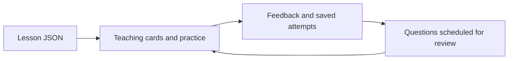

# Drill

Drill helps turn a set of lessons into practice you can return to. It explains a concept, asks you to apply it, and saves your answers so you can review the questions you missed.

[How it works](#how-it-works) · [Visual walkthrough](#visual-walkthrough) · [Quick start](#run) · [Try the demo](#five-minute-demonstration) · [Inputs and outputs](#inputs-and-outputs) · [Technical design](ARCHITECTURE.md) · [Tests and limits](QA.md) · [Contribution and license](PROVENANCE.md)

## How it works

Choose a lesson and work through teaching cards and questions. Practice mode explains each answer as you go; exam mode holds feedback until the end. Drill keeps your attempts, notes and review schedule on your own computer. You can leave a session and resume it later.

The included example teaches a fictional workshop's parcel process: Receive, Pack, Dispatch. One lesson file supplies the teaching card and four questions. Answering them correctly produces a 4/4 score, a saved attempt and scheduled review questions. The example demonstrates the app without using real course materials or learner records.



## Visual walkthrough

These screens follow the included fictional parcel lesson.

### Choose a lesson

The home screen lists the lesson and any questions due for review. Start practice to learn the Receive, Pack, Dispatch process.


### Answer and get feedback

Choose an answer to see why it works. Teaching cards explain the process first; matching and ordering questions check whether you can apply it.


### Finish and return later

Four correct answers produce a 4/4 result. Drill saves the attempt and schedules the questions for review, so progress remains after you reload.


<details>
<summary>Earlier full-size result capture</summary>


</details>

The sections below explain how to run the app, supply your own lessons and inspect its implementation. No programming is needed to try the included lesson once the local server is running.

## Run

Requires Python 3.10 or newer. No packages, account, API key, installation step, or network access is needed to use the app. Node.js 18 or newer is used only by authoring and regression checks.

From this folder:

```sh
python3 server.py
```

Open **http://127.0.0.1:8765** in your browser. Stop the server with Ctrl+C. Opening the HTML file directly will not provide persistence. The server creates `Data/drill.sqlite3` on first launch and a SQLite recovery snapshot each time it starts. This folder is ignored by Git. There is no preloaded database.

To use a separate study database or port:

```sh
python3 server.py --port 8766 --data Data/another-demo.sqlite3
```

## Five-minute demonstration

1. Open **Parcel flow at Cedar Workshop** and choose practice.
2. Read the teaching card and reveal its answer. Teaching cards do not affect the score.
3. Answer **Pack** for the first question; select **Receive the order** and **Pack the item** for the next question.
4. Match each stage to its action, then order the stages **Receive → Pack → Dispatch**. Correct on the first try throughout produces **4/4**. After the brief counter animation finishes, Accuracy shows **100%**. Known remains **0/4** after this first success: a question must reach review box 2 to count as known.
5. Return home. The attempt remains in the history. An intentionally missed question appears in the review queue; a correct answer advances its review schedule.
6. Start an exam to see feedback deferred until results. Leave an unfinished run and resume it from home.
7. Add a note or flag a card. Use **Save file** to download a schema-2 JSON backup. Restart the server: saved progress remains.

Import is intended for an empty database. It refuses to overwrite existing study data. To demonstrate a restore, start a separate database with the command above and import your export there. These two databases do not synchronize.

## Inputs and outputs

| Input | Expected output |
| --- | --- |
| `examples/lesson.json` | One five-card lesson: one unscored teaching card and four scored questions |
| Correct answers in the walkthrough | Completed attempt scored 4/4; four scheduled review references |
| Wrong answer | Explanation and a question due for review immediately |
| Note or flag | Saved entry attached to the permanent test ID and card index |
| Save file | `drill-state.json` containing schema version 2 and saved documents |
| Stale write from another tab | Conflict response and a recovery dialog instead of silent replacement |
| `examples/additional-lesson.json` through the append helper | A new candidate HTML file with two lessons; original lesson unchanged |

## Author a lesson

```sh
node append-test.mjs drill.html examples/additional-lesson.json candidate.html
node qa/content-check.js candidate.html
```

The helper refuses existing output files and duplicate test IDs. It creates a candidate without adopting it. Review the candidate before using it. Never reorder existing cards or rename their IDs: saved history references `[testId, cardIndex]`.

JSON supports teaching cards, single-choice and select-all questions, matching pairs, ordered steps, explanations, tags, and optional images. The shipped fixtures are the complete examples. For an additional image, use an original or appropriately licensed embedded image with descriptive alt text. Treat lesson HTML and authoring inputs as trusted local code, not as arbitrary third-party uploads.

## Verify

```sh
python3 -B qa/verify.py
```

The check runner tests the actual inline app script, synthetic storage, a temporary loopback HTTP server, content validation, and safe lesson appending. Temporary test data is separate from normal study progress. See [QA.md](QA.md) for measured results and limits, [ARCHITECTURE.md](ARCHITECTURE.md) for internals, and [PROVENANCE.md](PROVENANCE.md) for contribution and licensing status.

## Questions and project context

For a reproducible bug, [open an issue](https://github.com/NicholasFarrar2004/drill-study-app/issues) with the steps, expected result and Python/browser versions. Use fictional examples instead of private lessons or study backups.

Nicholas Farrar defined the learning workflow and directed AI-assisted implementation and testing. The [contribution record](PROVENANCE.md) explains that division of work. This is a local study app; remote hosting and cross-device synchronization are outside its current scope. No open-source license has been assigned.
